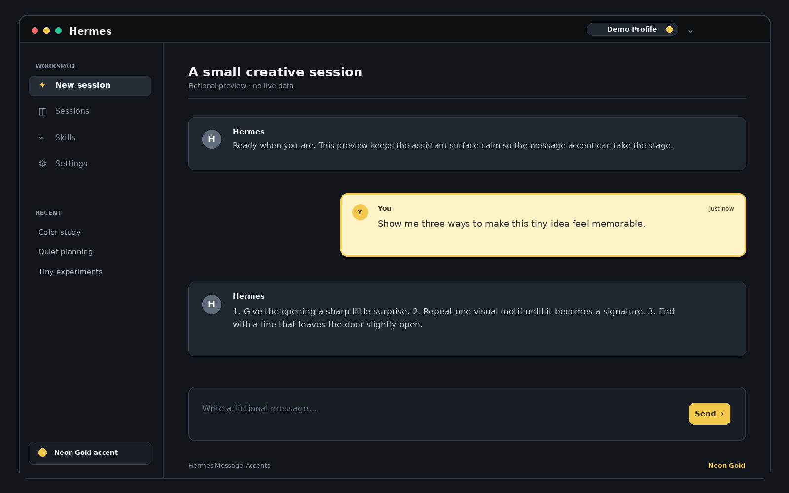
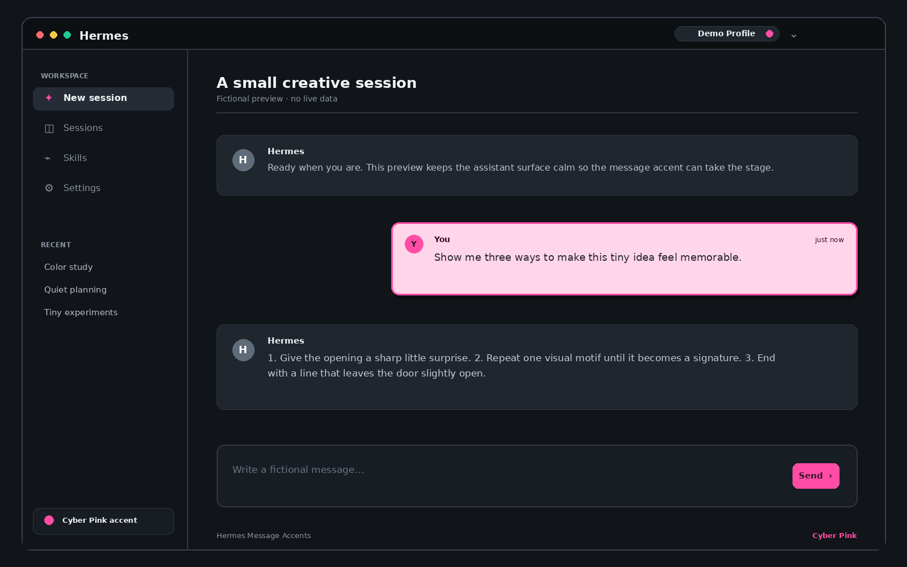
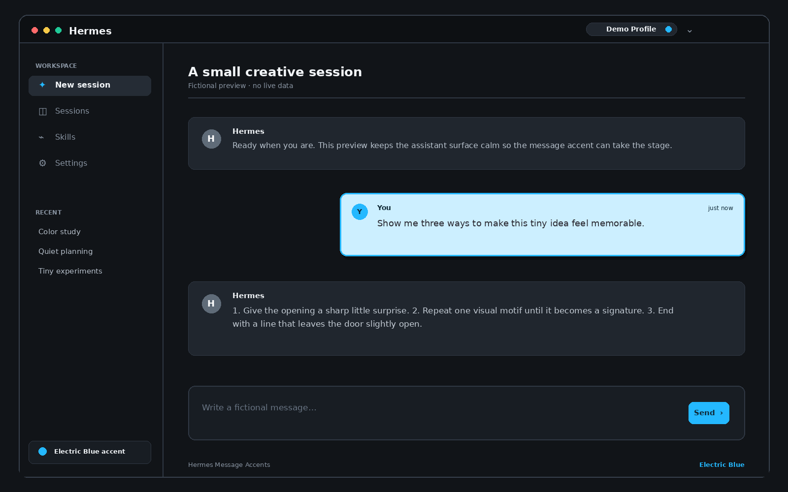
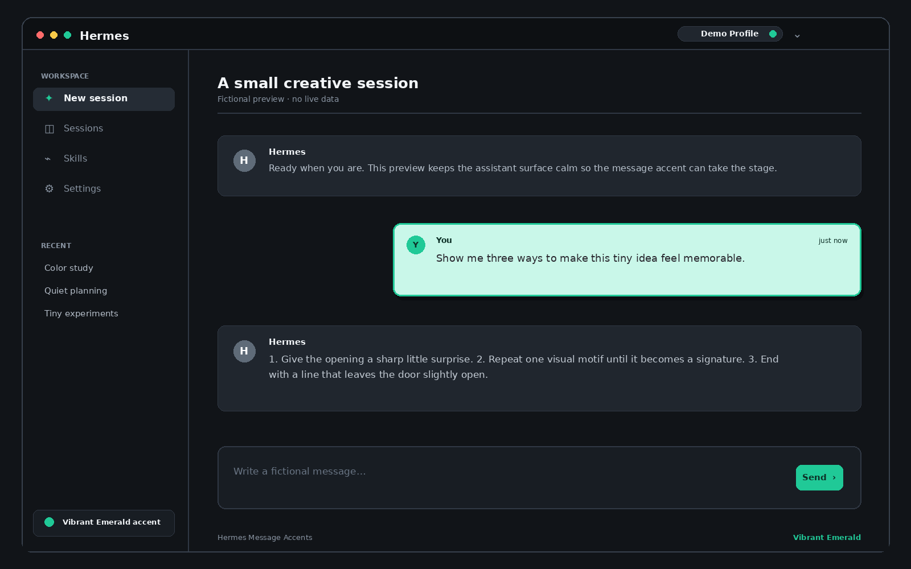

# Hermes Message Accents

A small, installable [Hermes Desktop](https://hermes-agent.nousresearch.com/) plugin that gives user messages a configurable visual accent.

It changes the **user-message bubble** only. Hermes responses and the overall Desktop theme are left unchanged.

## Included schemes

- **Neon Gold**
- **Cyber Pink**
- **Electric Blue**
- **Glow Purple**
- **Vibrant Emerald**

## Preview gallery

These fictional desktop previews show the user-message accent while keeping the assistant surface neutral. They contain no real searches or conversation data.

| Neon Gold | Cyber Pink |
| --- | --- |
|  |  |

| Electric Blue | Vibrant Emerald |
| --- | --- |
|  |  |

## Installation

Copy `desktop-plugins/user-input-highlight/plugin.js` into your Hermes Desktop plugin directory:

```text
~/.hermes/desktop-plugins/user-input-highlight/plugin.js
```

The folder name must match the plugin ID: `user-input-highlight`.

Hermes Desktop normally detects the plugin automatically. If it does not appear, open the Command Palette and run **Reload desktop plugins**.

## Use

- Open the Command Palette and choose **Highlight User Input: Set to …**.
- Or click the highlighter indicator in the status bar to cycle schemes.
- The selected scheme is persisted by the plugin and applies to future user-message bubbles.

## Uninstall

Remove the `user-input-highlight` plugin folder, reload desktop plugins, and restart Hermes Desktop if the old style remains visible.

## License

MIT. See [LICENSE](LICENSE).
